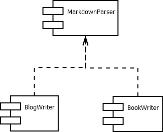

# Write for people, computers and food

Hi. This is the source from my [blogue] posts published using [GitHub Pages], my [books published] using Python scripts and other texts published elsewhere.

The public folder is the output folder that will contain publishable content.

## How to use

If you just cloned this repo the core text is in the `journal.txt` file. The usable code, including the ones to publish this content, is in the `code` folder.

To publish the blog you should call `code/PublishBlog.py`, to generate the book `code/Journal2Book.py`. You can run a local version of the blog by using the `code/Journal2Blog.py` followed by `public/book/BlogServer.py` script.

The parsing and transformation scripts are written in AWK. A part of the code parse the `journal.txt` to metadata that are then transformed to a HTML blog or an EPUB book (convertible to MOBI format as well). The architecture goal being worked is as follows:

I use an operating system called Windows, but the code should work fine from Unix env. I am in the middle of a project to finish a markdown parser and currently it is a workable mess.

The vast majority of my text is in my native language Portuguese, from Brazil. This should not be an issue now that machines translate flawlessly every pieace of internet to every conceivable language. But be my guest to learn something from this wonderful language and ask questions by [email] if you need to.

Thank you for the interest into my texts. Hope you find something useful here. Bye and thank you for all the steak.

[blogue]: https://caloni.com.br
[GitHub Pages]: https://github.com/Caloni/caloni.github.io
[books published]: https://www.amazon.com/s?rh=p_27%3AWanderley%2BCaloni
[email]: mailto:wanderley.caloni@gmail.com
