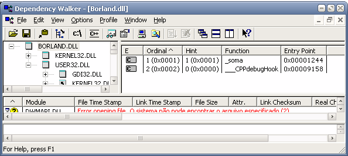
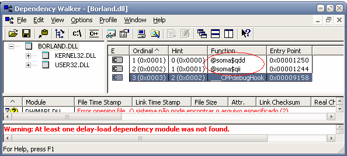
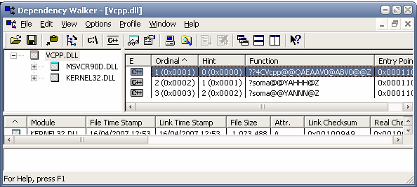

A [sobrecarga estática](http://www.caloni.com.br/blog/archives/polimorfismo-estatico) possui algumas desvantagens em relação ao sistema de nomes da boa e velha linguagem C: ela **não foi padronizada** entre compiladores. O que isso quer dizer na prática é que funções exportadas de bibliotecas dinâmicas (DLLs) vão possuir nomes diferentes dependendo do compilador utilizado (e sua versão). Isso é o que chamamos [name mangling](http://en.wikipedia.org/wiki/Name_mangling).

Em dois projetos usando Visual C++ 2008 e Borland C++ Builder 5 (última versão que funciona direito) eu fiz uma exportação da função soma em linguagem C (o fonte é um .c). Veja o resultado:

Já usando a linguagem C++ (o fonte é um .cpp) temos outro resultado totalmente diferente para nossas duas funções soma descritas [no artigo anterior](http://www.caloni.com.br/blog/archives/polimorfismo-estatico):

Se quiser tentar entender essas letrinhas bizarras, recomendo baixar [projetos de exemplo](../public/uploads/name-mangling.7z). Se apenas entender que você não conseguirá juntar classes VC++ e Builder usando **[dllexport](http://msdn.microsoft.com/en-us/library/a90k134d(VS.80).aspx)** para tudo quanto é lado, então terminamos por aqui.
