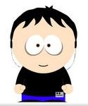

```cpp
-----BEGIN GEEK CODE BLOCK-----
Version: 3.1
GCS/PA d-(++) s-:(+) a C++$ UL->$ P? L+>$ !E- W++(+++)>$ N(++) o? K--? w+++$ O? M? V? 
PS(+++) PE++()>$ !Y? !PGP !t 5? !X !R tv? b(+) DI+(++) D G(+) e+ h--- r+++ y+* 
------END GEEK CODE BLOCK------
```

 Wanderley Caloni é um programador C/C++ especializado em backend para Windows que decidiu ter seu próprio blogue técnico. Tenta mantê-lo atualizado com suas peripécias do dia-a-dia. Colaborador frequente do Grupo C/C++ Brasil, foi junto de [Rodrigo Strauss](http://www.1bit.com.br/) um dos fundadores e participante do primeiro encontro de [programadores C++](http://groups.google.com/group/ccppbrasil) de São Paulo. Trabalhou por dez anos na área de Segurança da Informação, principalmente no [Controle de Acesso a Usuários](http://www.scua.com.br) e [Análise de Trojans](http://www.opencs.com.br/site/). Atualmente tem trabalhado em projetos de desenvolvimento para a [Área Financeira](http://www.ezmarket.com.br/) e consultoria, se tornando sócio da [BitForge](http://www.bitforge.com.br), uma empresa que auxilia equipes de desenvolvimento em problemas complexos, seja em arquitetura, procedimento ou escovação de bits, mesmo.

Uma informação importante: é [cinéfilo inveterado](http://cinetenisverde.com.br) nas horas vagas, o que faz com que ele escreva muito mais sobre filmes (requer pouca pesquisa).

Também costuma dar pitacos sobre todos esses temas e outros mais em seu [twitter pessoal](http://twitter.com/#!/caloni).

Nas horas vagas, ele também programa. Mais.

<a href="https://www.flickr.com/photos/120157483@N04/15007582904" title="mvp by Wanderley Caloni, on Flickr"></a> De 2013 a 2015 foi nomeado [MVP (Most Valued Professional) pela
Microsoft](http://mvp.microsoft.com/pt-br/mvp/Wanderley%20Caloni-5000295), um prêmio em consideração pelas colaborações à comunidade C/C++.

Se, mesmo com esse resumo, você tiver mais alguma dúvida a respeito de
algo que eu conheça, não hesite em falar comigo! Abaixo temos uma breve
lista das coisas que eu andei fazendo na minha breve vida de
programador. 

```cpp
.dump /ma curriculo.dmp
```

-   Inventário de hardware (WMI/SMBIOS) e software (registro)
-   Proteção da área de transferência e PrintScreen através de hook de
    janelas e manipulação de mensagens globais
-   Escrita de alertas no log de eventos do sistema através de drivers
-   Comunicação user/kernel mode através de DeviceIoControl
-   Acesso remoto de desktop através de ferramenta similar ao VNC
-   Ferramenta de execução remota similar ao PsExec
-   Controle de impressão de documentos através de regex (Boost) usando
    hook do Shell
-   Gerenciamento de diretivas de acesso do sistema durante logon e
    logoff de usuários (registro e hooks)
-   Migração de base de dados CTree para SQL (classes OLE)
-   Autenticação Windows com serviço DCOM e GINA customizada ou
    Credential Provider (Vista)
-   Sincronismo remoto de base de dados CTree usando serviço DCOM
-   CD Linux bootável com scripts bash e ferramentas de criptografia de
    discos em linguagem C
-   Driver de criptografia de discos rígidos e armazenamento USB
    (PenDrives)
-   Análise de telas azuis ou dumps de memória usando WinDbg
-   Serviço COM de execução de aplicativos na conta de sistema
-   Customização da MBR (Master Boot Record) de acordo com
    características da BIOS
-   Biblioteca de criptografia Blowfish e SHA-1 em C++ e Assembly 16
    bits
-   Driver de auditoria de acesso com memória compartilhada e eventos
    entre user e kernel
-   Hook de API em kernel mode para plataformas NT e 9X
-   Carregador de boot em Assembly 16 bits; depuração usando Debug.com
-   Proteção de executáveis através de autenticação em domínio
    configurado no resource dos arquivos
-   DLL de proteção à navegação em Internet Explorer 6/7 e Firefox 1/2
    com injeção de código Assembly 32 bits
-   Biblioteca de proteção de código, strings e execução monitorada; uso
    de interrupções Win32
-   Biblioteca de geração de log centralizado através de memória mapeada
    e eventos globais
-   BHO (Broser Helper Object) e ActiveX para Internet Explorer 6/7 e
    plugin XPI para Mozilla/Firefox
-   Gerenciamento de projetos com Source Safe, Bazaar e scripts Batch
-   Depuração de kernel mode em plataforma NT usando SoftIce e WinDbg,
    em 9X usando SoftIce e WDeb98
-   Engenharia reversa de trojans feitos em C++, Visual Basic e Delphi
    usando WinDbg e IDA
-   Ferramenta de diagnóstico que lista arquivos, serviços, drivers,
    registro, partições, processos, etc da máquina
-   Monitoramento de jobs em Windows 2000+ para controle de instalação e
    atualização de produtos
-   Monitoramento da frequência de uso de aplicações usando hook de
    janelas invasiva e não-invasiva
-   Engenharia reversa do dicionário Houaiss e importação para o formato
    Babylon
-   Controle de build com Cruise Control .NET, servidor de símbolos com
    Debugging Tools for Windows
-   Documentação de projetos através de Doxygen e Wiki (Trac)
-   Interfaces de gerenciamento em C++ Builder 5/6 e bibliotecas Visual
    C++
-   Analisador de e-mails usando expressões regulares (ATL)
-   Interfaces de análise em Visual C++ (MFC /ATL/WTL)
-   Análise de logs e edição global de projetos utilizando regular
    expressions
-   Desenvolvimento de artigos através de blogue técnico e comunidade
    Code Project (esse você já sabia, não é?)

